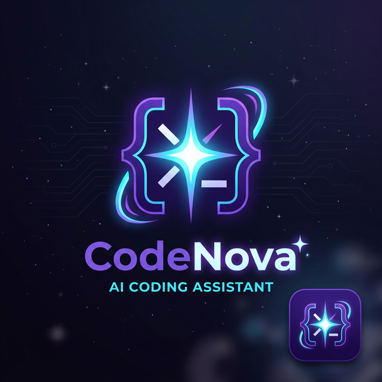
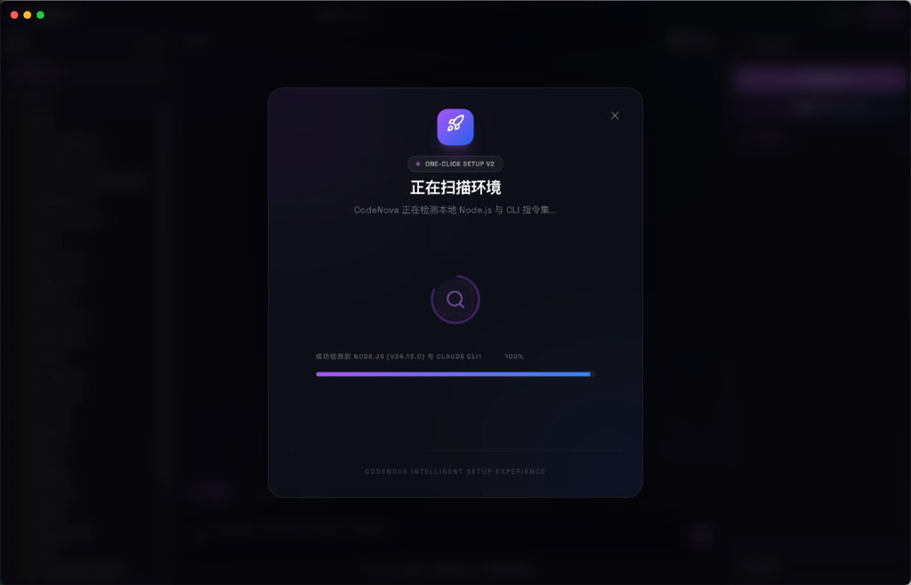
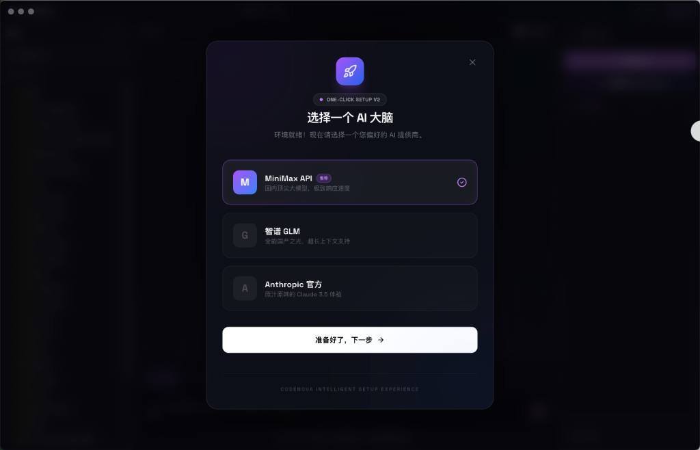
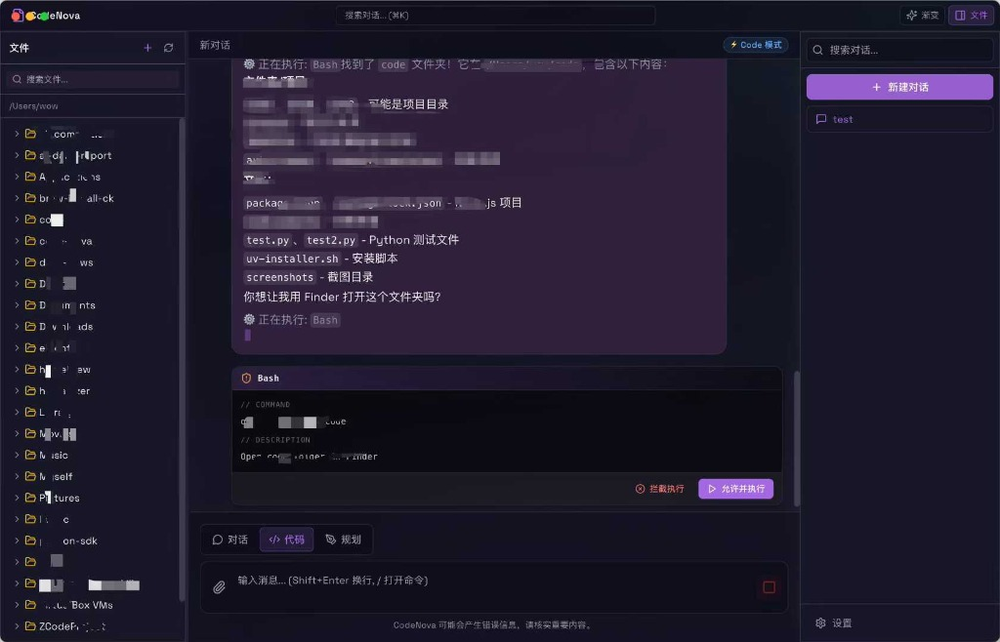
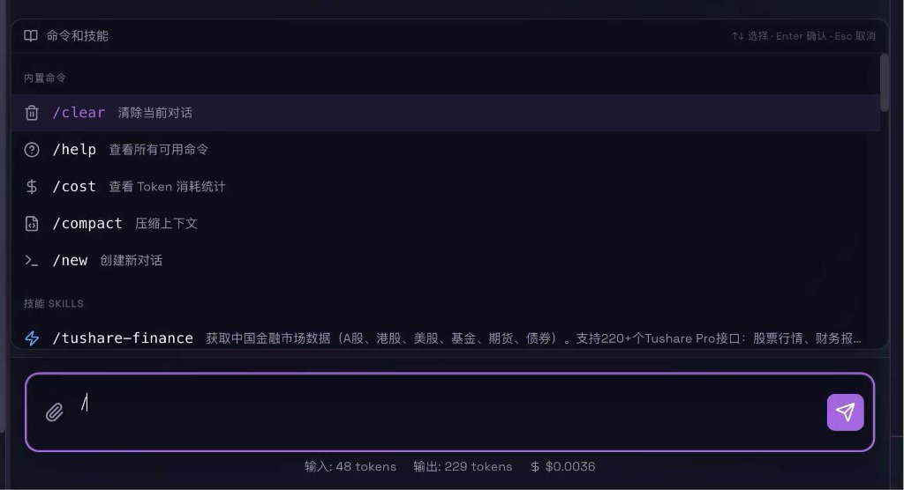
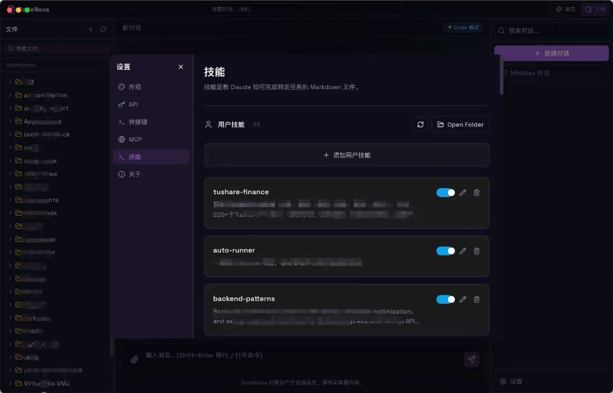
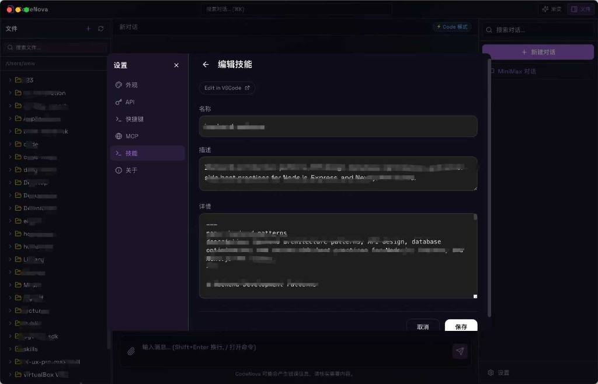
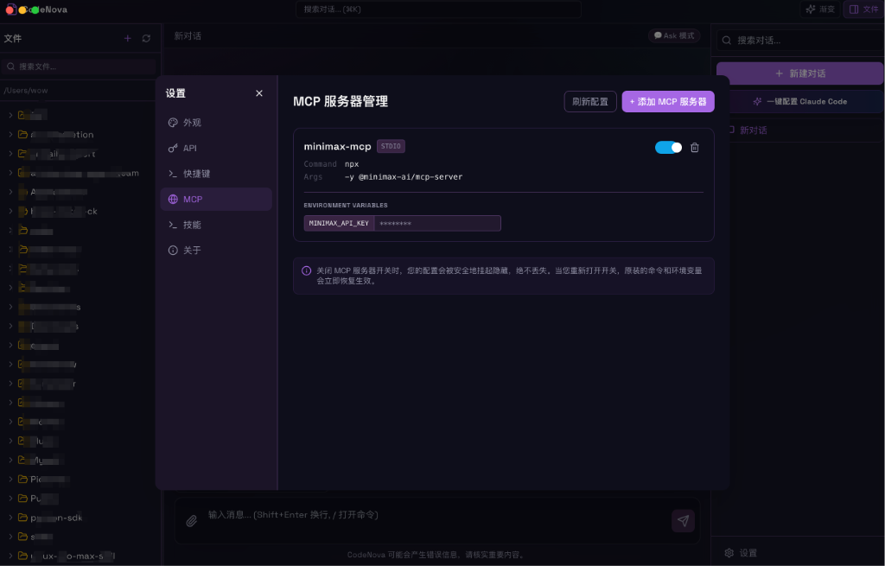

<div align="center">
  
  <h1>🚀 CodeNova</h1>
  <p>给 Claude Code 装上跑车引擎：你的原生桌面级 AI 编程助手</p>
</div>

CodeNova 是基于官方 **Claude Agent SDK** 打造的现代化桌面可视化客户端。它保留了 Claude Code 强大的底层自动编程、终端执行和文件改写能力，同时补齐了命令行工具在交互体验、安全管控和项目管理上的短板。

---

## ✨ CodeNova 相较于原生 Claude Code (CLI) 的优势

| 核心优势 | CodeNova (桌面客户端) | Claude Code (命令行 CLI) | 获得体验 |
| :--- | :--- | :--- | :--- |
| **⚡ 一键部署配置** | **全自动环境部署向导**<br>内置一键下载与环境配置，支持 **私有沙盒隔离** 与 **全局 Terminal 接管**，各大模型预设自动映射。 | **繁琐的手动依赖**<br>需自行配置 Node 环境及全局参数。 | **零门槛安装**。既可绿色便携，也能深度接管原生环境。 |
| **📁 可视化项目树** | **内置文件树面板**<br>点击阅读代码，直接拖拽文件给 AI。 | **纯文本路径**<br>通过 `ls` 查看，需手动输入绝对路径。 | **降低心智负担**。告别终端盲打，直观管理上下文。 |
| **💬 对话自动保存** | **原生带历史记录的聊天流**<br>左侧边栏自动按时间管理你的历史开发进程，关机也不丢。 | **阅后即焚（难追溯）**<br>关闭终端后需要去非常隐蔽的缓存或者手敲特定命令恢复历史。 | **开发进程不中断**。多项目、多任务并行时游刃有余。 |
| **🧩 Skill 抽屉管理** | **侧边栏 UI 表单**<br>像插件一样一键开关，填表式编辑。 | **隐藏 MD 文件**<br>手动在隐藏文件夹创建符合格式的文件。 | **零门槛复用**。轻松管理个人专属 Prompt 绝招。 |
| **🔑 第三方 API 配置** | **双模智能面板**<br>自动识别本地 `claude` 配置；亦可 UI 填表一键秒切 API 代理。 | **环境变量死磕**<br>需钻入终端修改 `.zshrc` 或查阅繁琐的环境变量文档。 | **开箱即用的丝滑**。自带配置无缝继承，对接高性价比首选。 |
| **💰 实时成本面板** | **底部悬浮窗**<br>实时自动滚动计算 Token 及花费。 | **命令触发**<br>需要手动输入 `/cost` 才能查看日志。 | **告别价格焦虑**。时刻掌控开销，防止意外扣费。 |
| **🛡️ 交互式安全管控** | **精美弹窗拦截**<br>清晰展示待执行的脚本和代码变动。 | **终端 `(y/N)` 闪烁**<br>混合在海量输出日志中，极易误触。 | **绝对安全防线**。从容审核高危操作，拒绝删库跑路。 |
| **🔌 MCP 可视化管理** | **直观的表单操作与状态开关**<br>无缝添加、传参管理 MCP 服务，数据无损暂存及屏蔽。 | **隐藏层级的 JSON**<br>需手动钻进隐藏配置目录排查 JSON 格式错误。 | **随心扩展边界**。极大降低插件服务的注册与调试门槛。 |

---

## 🎨 Showcase (界面展示)

**1. 一键部署 Claude Code (智能环境检测与各大模型预设挂载)**  




**2. 沉浸式项目管理界面 + 对话保存 + 危险命令安全拦截卡片**  


**3. 实时成本面板 + /命令**  


**4. 第三方 API + 本地 Claude Code 识别**  


**5. 技能 (Skill) 抽屉式聚合页面**  


**6. Skill 管理编辑详情**  


**7. MCP 可视化管理**  


---

## 📥 下载与安装

提供两种使用方式，你可以直接下载开箱即用的安装包，或是克隆源码在本地通过命令行编译启动。

### 方式一：直接下载安装包 (推荐)
前往项目的 [Release 页面](https://github.com/zkw15555506767-boop/CodeNova/releases/tag/v1.0.3) 下载最新的 **v1.0.3 版本** DMG 安装文件。
1. 下载 `CodeNova-1.0.3-arm64.dmg`。
2. 双击打开，将 **CodeNova** 图标拖拽进入 `Applications` (应用程序) 文件夹。
3. 在启动台中打开即可使用！

### 方式二：源码启动 (开发者)
```bash
# 1. 克隆仓库
git clone https://github.com/zkw15555506767-boop/CodeNova.git
cd CodeNova

# 2. 安装依赖
npm install

# 3. 启动应用
npm run electron:dev
```

### 解决 macOS "应用已损坏" / "无法验证开发者" 问题
由于此安装包是用个人开发者证书构建的，macOS 的安全机制（Gatekeeper）可能会默认拦截从网页下载的应用。

**解决方案：**
1. 把 CodeNova.app 放到 Applications (应用程序) 文件夹后
2. 打开系统自带的 **终端 (Terminal)** 
3. 复制并执行以下命令解除系统的隔离限制（过程可能会要求你输入电脑开机密码）：
   ```bash
   sudo xattr -rd com.apple.quarantine /Applications/CodeNova.app
   ```
4. 执行完成后，再去启动台点击 CodeNova 即可满血畅听！

---

## 🤖 强大的模型支持

CodeNova 支持动态切换底层驱动的 AI 模型，只需在设置面板或右上角下拉菜单一键切换：
- **Claude 系列**: Claude 3.5 Sonnet (默认最强)、Opus、Haiku 等。
- **第三方兼容 API**: 国内极速大模型体验！目前已原生测试支持 **MiniMax (abab6.5s 等)** 以及 DeepSeek 等兼容 OpenAI 格式的高性价比局域网/国产大模型，让你在没有官方 API 的情况下依然享受到强悍的 Code 编写能力！

---

## 🗺️ Future Plans (未来规划)

我们的征途才刚刚开始，以下是 CodeNova 接下来即将上线的杀手级特性：

- [x] **一键部署 Claude Code**: 极简化新手的上手门槛，剥离复杂的环境配置依赖，在 APP 内部做到“一键下载并配置底层引擎”。已支持“私有沙盒模式”环境与“系统全局覆盖”切换，实现多模型环境变量自动注入别名逻辑。
- [x] **MCP 服务器可视化管理 (MCP Manager)**: 完全告别原生 SDK 读取报错 JSON 的痛点。通过界面无缝读取、配置（支持独立环境与启动指令截取），并实现关停模式无损数据挂起逻辑 (`disabledMcpServers`)。
- [ ] **Remote Control (远程开发接入)**: 突破本地系统限制，支持一键连入远端服务器或 Docker 容器的终端，让 Agent 在沙盒/云端优雅地执行高危任务和自动化运行测试。
- [ ] **定时任务与心跳守护 (Cron & Heartbeat)**: 将 CodeNova 变成你的自动化数字打工人。支持设置巡检定时任务，比如“每天早上检查 CI 报错日志并尝试修复给出 PR”，即使在前台挂起时，大模型也能按照心跳机制持续帮你监控代码库健康状态。

---

## 📄 许可证

本项目基于 [MIT License](LICENSE) 协议开源。
欢迎各位开发者提交 Issue 和 Pull Request，一起来打造最好用的跨平台 AI 客户端！
